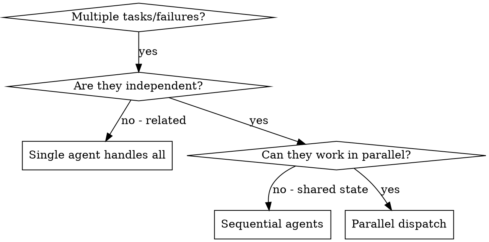

# Dispatching Parallel Agents

## Overview

Delegate independent tasks to specialized subagents working concurrently. Each agent gets isolated context crafted for its specific problem — never your session history.

**Core principle:** Dispatch one agent per independent problem domain. Let them work concurrently.

## When to Use


**Use when:**
- 3+ test files failing with different root causes
- Multiple subsystems broken independently
- Multiple research questions to investigate
- Each problem can be understood without context from others
- No shared state between investigations

**Don't use when:**
- Failures are related (fix one might fix others)
- Need to understand full system state first
- Agents would interfere (editing same files, using same resources)
- Exploratory debugging (you don't know what's broken yet)

## The Pattern

### 1. Identify Independent Domains

Group work by what's independent:
- File A tests: Tool approval flow
- File B tests: Batch completion behavior
- File C tests: Abort functionality

Each domain is independent — fixing one doesn't affect the others.

### 2. Create Focused Agent Prompts

Each agent gets:
- **Specific scope:** One test file, one subsystem, one research question
- **Clear goal:** What success looks like
- **Constraints:** What NOT to change
- **Expected output:** What to report back

Good agent prompts are:
- **Focused** — one clear problem domain
- **Self-contained** — all context needed to understand the problem
- **Specific about output** — what should the agent return?

### 3. Dispatch in Parallel

Use the Agent tool with multiple invocations in a single message. All agents run concurrently.

```markdown
Agent 1: "Fix agent-tool-abort.test.ts — 3 failures related to timing..."
Agent 2: "Fix batch-completion-behavior.test.ts — 2 failures where tools don't execute..."
Agent 3: "Fix tool-approval-race-conditions.test.ts — 1 failure with execution count = 0..."
```

### 4. Review and Integrate

When agents return:
1. **Read each summary** — understand what changed
2. **Check for conflicts** — did agents edit same code?
3. **Run full test suite** — verify all fixes work together
4. **Spot check** — agents can make systematic errors

## Prompt Example
```markdown
Fix the 3 failing tests in src/agents/agent-tool-abort.test.ts:

1. "should abort tool with partial output capture" - expects 'interrupted at' in message
2. "should handle mixed completed and aborted tools" - fast tool aborted instead of completed
3. "should properly track pendingToolCount" - expects 3 results but gets 0

These are timing/race condition issues. Your task:

1. Read the test file and understand what each test verifies
2. Identify root cause - timing issues or actual bugs?
3. Fix by replacing arbitrary timeouts with event-based waiting or fixing bugs
4. Do NOT just increase timeouts - find the real issue

Return: Summary of root cause and what you fixed.
```

## Common Mistakes

| Mistake                                    | Fix                                       |
| ------------------------------------------ | ----------------------------------------- |
| Too broad ("Fix all the tests")            | Scope to one file or subsystem            |
| No context (just "Fix the race condition") | Include error messages and test names     |
| No constraints                             | Specify what NOT to change                |
| Vague output ("Fix it")                    | Ask for summary of root cause and changes |

## Integration

**Works with:**
- `process:execute` — multi-worktree optimization for independent checklist items
- `process:debugging` — when multiple independent failures need investigation
